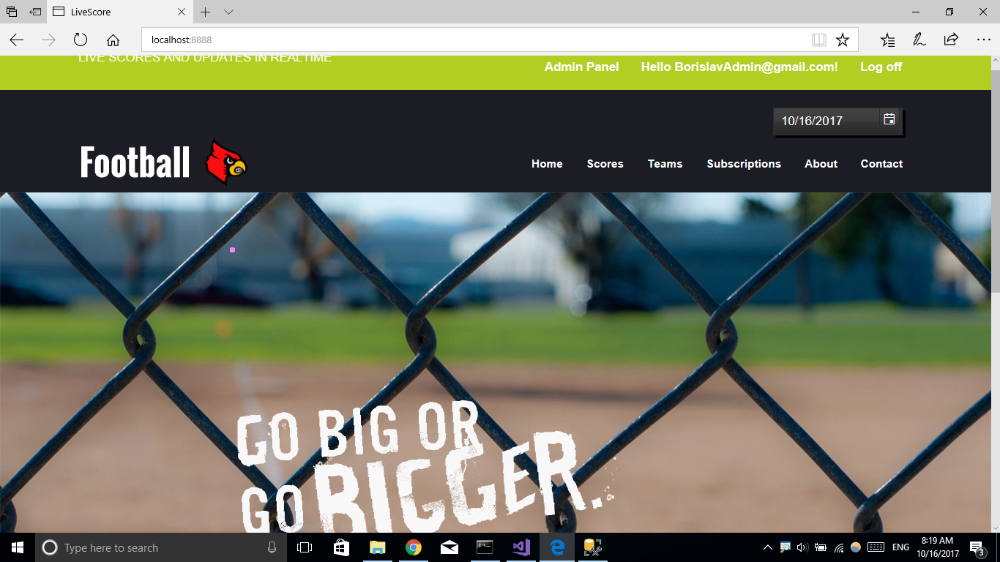
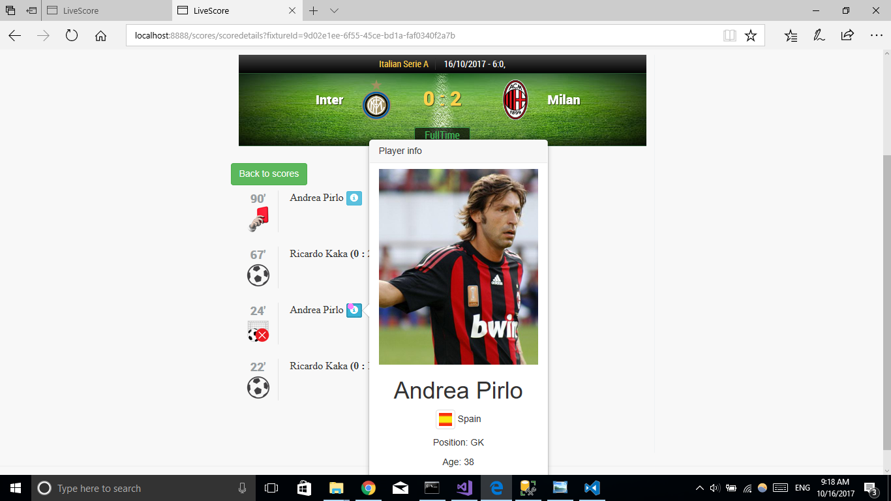
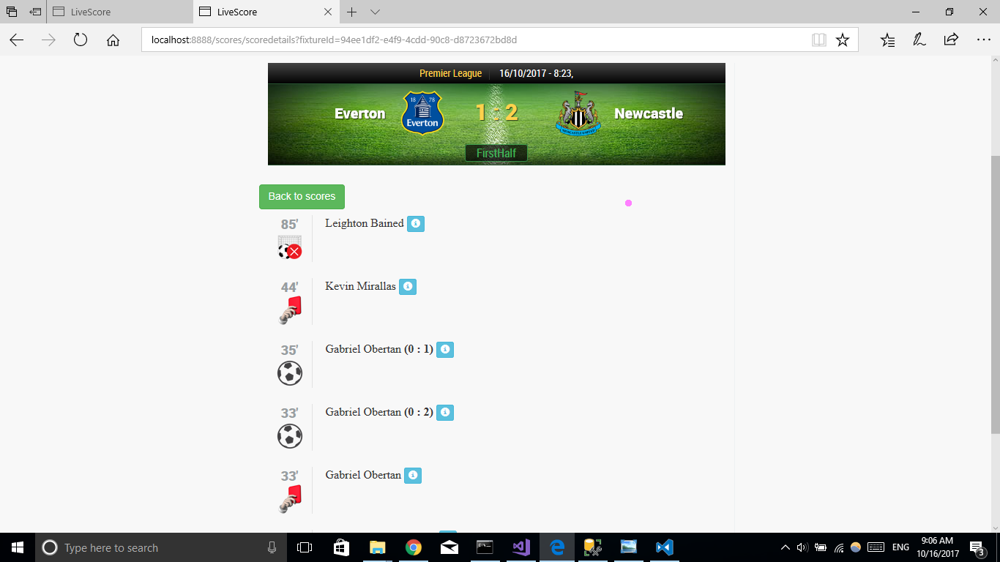
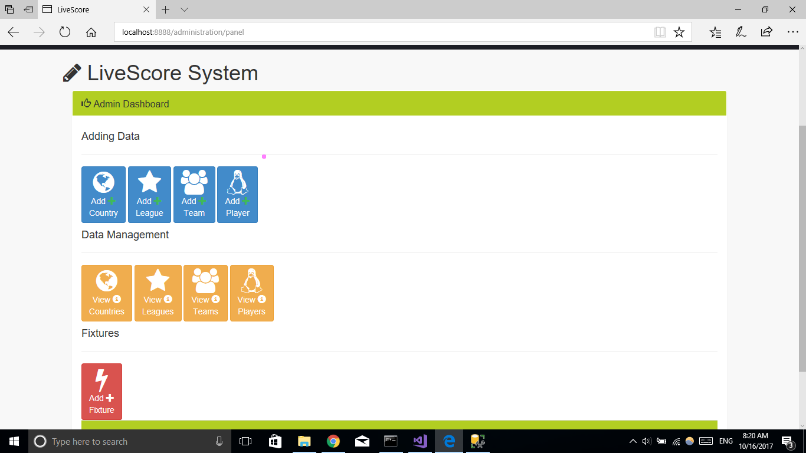
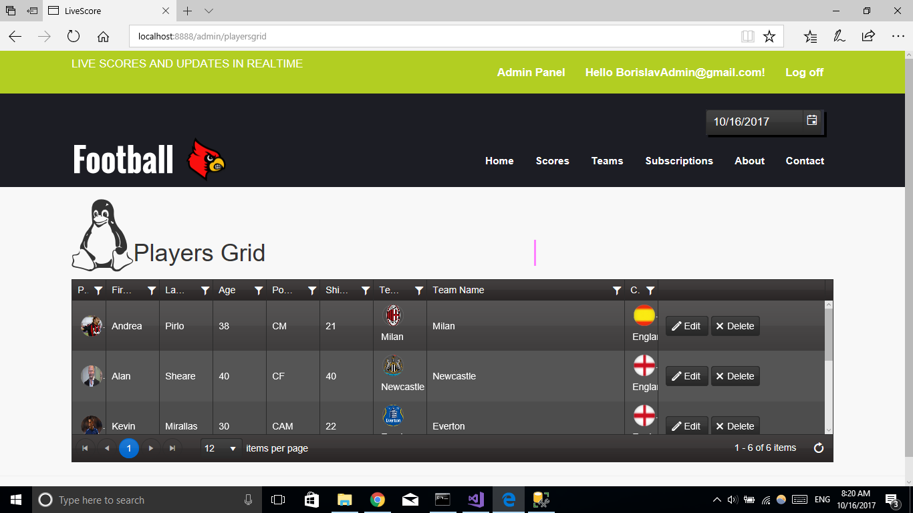
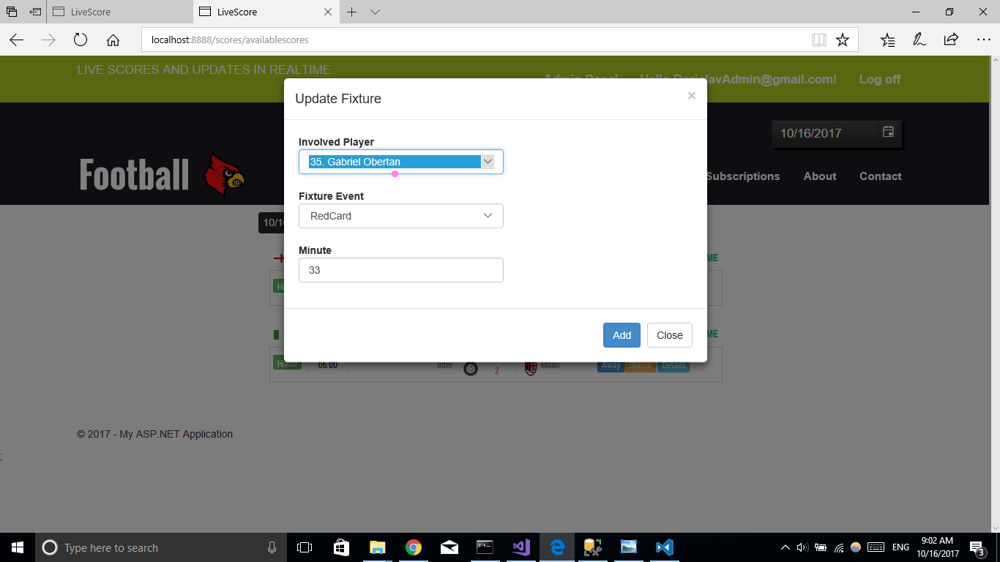

# LiveScoreUpdateSystem
ASP.NET MVC Project

## Build status

LiveScoreUpdateSystem is an ASP.NET MVC Project for the Telerik Academy season 2017/2017 Web Applications with ASP.NET MVC course

# Brief project documentation
#### Public part
  - Home Page
    - Where the fun starts :) 
    
  - Live score page
    - The top games being updated in realtime
    
  - Live Game details
    - See detailed information minute by minute for a specific game
    
  - About page
    - Information about the creator and contact
#### Authenticated part
 - User account
    - Manages his subscriptions (user can subscribe for a team and recieve email report with the game highlights)
    ![image][./application-images/teams-for-subscribtion.png]
#### Administration part
- Admin panel page
   - Menu containing all different features for managing the whole system
   
   - Access to every entity stored in the application
- Data access
   - Full access to managing entitites stored in the system
    
#### Live Updaters Part
- Updating live games
    - Access to updating and adding new events to live games (like goals, cards, penalties)
    